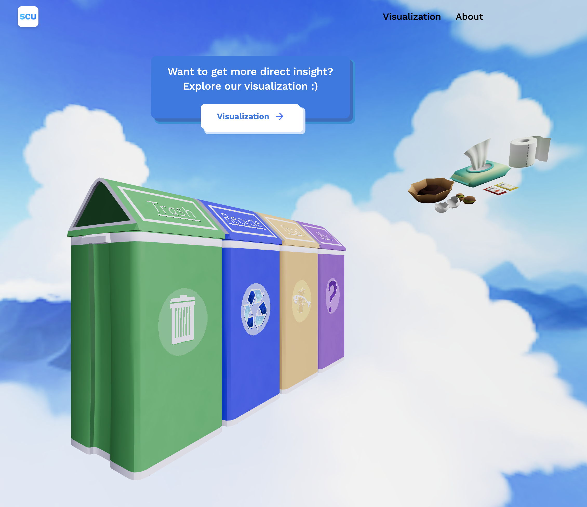
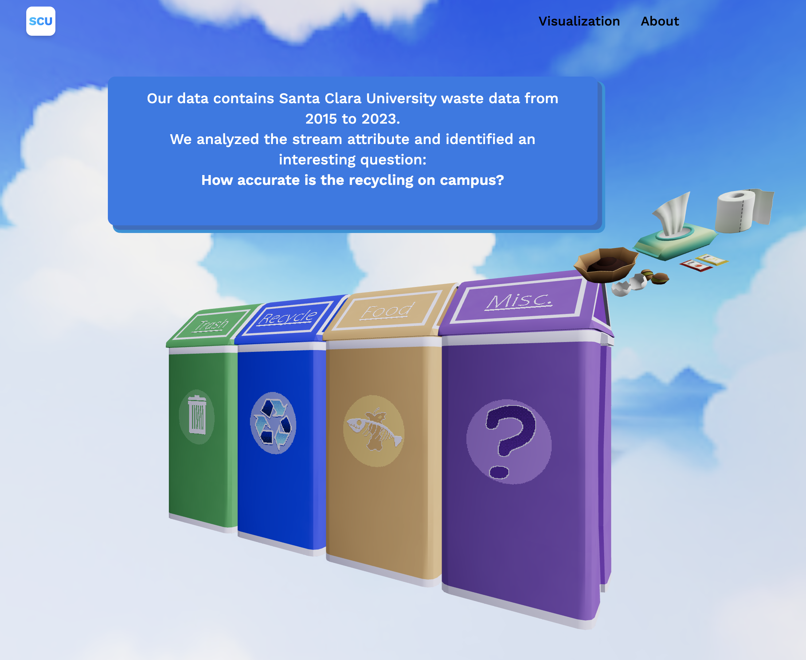
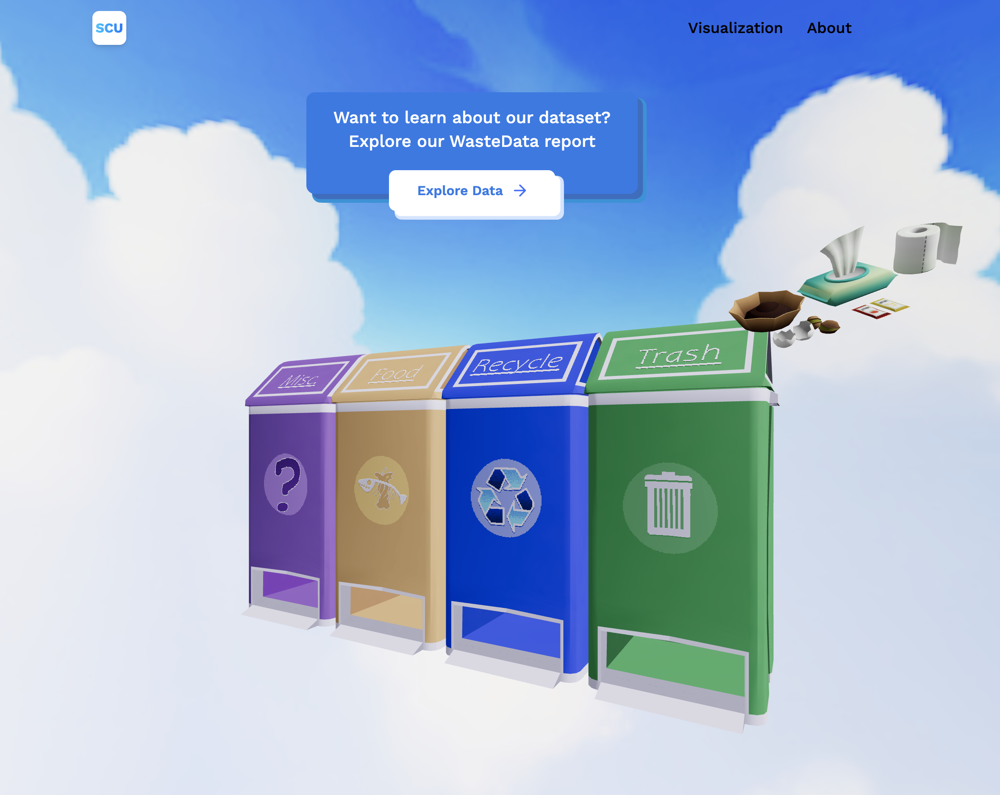
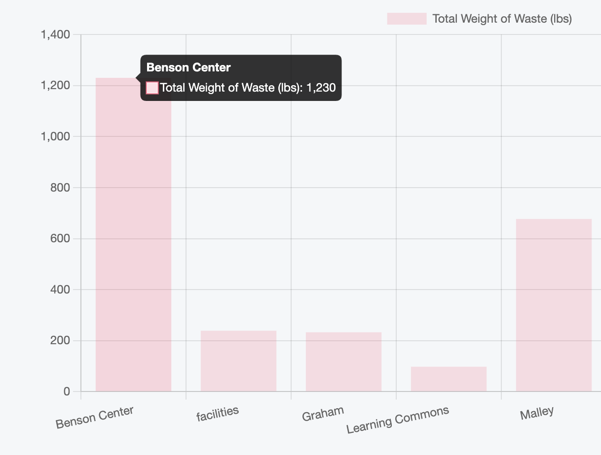
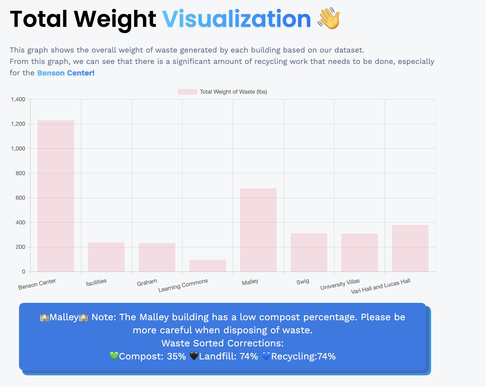
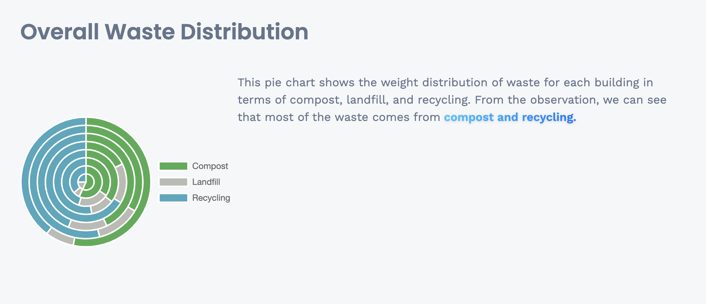
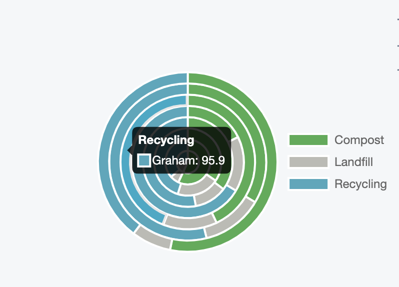

# Assign2-XinqiZhang
My visualization presents the phenomenon of waste sorting problems I discovered from the dataset and my further concerns.

The dataset pertains to waste logging at Santa Clara University and includes the following fields: Year, Date, Building, Stream (the waste label), Volume (as the unit), Weight (in pounds), and Notes (detailing the waste content), totaling 521 data points.

**Data Analysis:**

While examining the data, I observed the following:

1. There are missing values in the "Notes" field. Since this field is optional and the "Stream" field is more important for my analysis, I decided to retain entries despite the missing notes.
2. Focusing on the "Stream" field, I analyzed the rate at which people incorrectly sort their waste into the wrong bins. For example, in the "Compost" category, there are instances of "Compost in Recycling" and "Compost in Landfill." I calculated the sorting accuracy rate using this equation(Example Compost): Waste Correctness for Compost = 100 * Weight(Compost) / (Weight(Compost) +Weight( Compost in other trash  bin) 
1. Based on the previous waste stream correctness calculation, I found that there are many instances of "Compost" and "Recycling" being placed into "Landfill." However, when further analyzing the weight of each waste category by building, "Landfill" actually has the least waste produced on campus. This reveals that helping people throw waste into the correct bins is a very essential issue for the whole campus and could make a huge difference if everyone gets involved.

**Data Visualization:**

- **Home Page**

I built an interactive web-based visualization. When you enter the site (https://kikispace.github.io/Assign2-XinqiZhang/), you can see the home page with 3D draggable trash bins and a clean blue sky as the background. Trash flows in the sky.

You can try dragging the trash bins to trigger pop-up notes.

On the Navigation Bar, you can directly access the Visualization Page.

- **Visualization Page**

1. I used an interactive bar chart to show the total weight of waste and the sorting accuracy for each building.
   - **Hover** over the bar: You can see the detailed weight (lbs) for each building.
   - **Click** the bar: You can trigger a pop-up message with insights from the dataset and detailed waste sorting accuracy rates.

2. I used multi-series pie charts to visualize the waste category distribution among all buildings.
   - **Hover** over the pie: You can see detailed building information and quantitative information.

My overall visualization page follows the logic of first showing the phenomenon of waste sorting inaccuracies, then highlighting that the imbalance in waste categories does not match the actual waste quantities. This aims to inspire visitors to think about the importance of increasing the accuracy of waste sorting.

**Design Analysis and Aesthetic:**

My design encompasses interactive pie charts, bar charts, and a web 3D game-like prompt.

Color selection was informed by a palette of clean and fresh natural designs. I used a lot of blue to remind participants how beautiful our environment is.

While the design effectively communicates the intended narrative, there's room for improvement, particularly in simplifying complex graphs to aid participant comprehension. Soliciting feedback from actual participants could further enhance the clarity and effectiveness of the visualization.